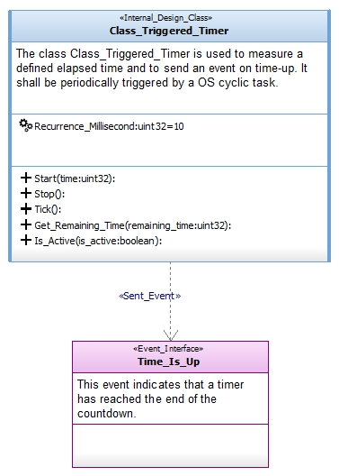
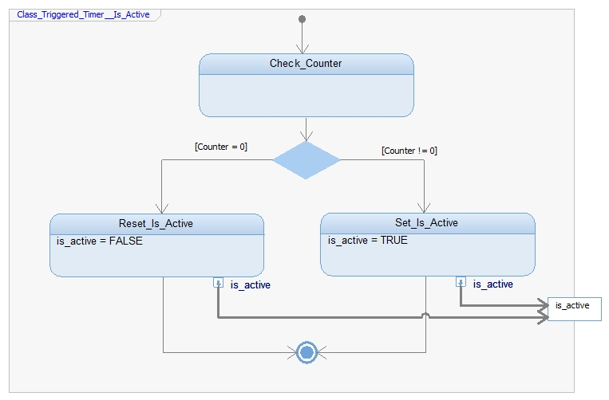
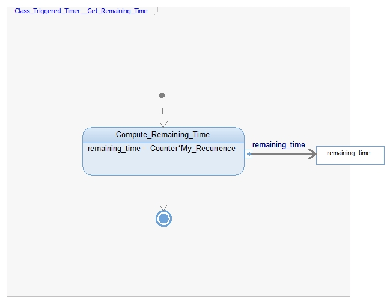

# Class_Triggered_Timer

Allows to measure a defined elapsed time and to send an event on time-up.

Modeled using the [Software_Model_Toolset](https://github.com/HomeMadeRobots/Software_Model_Toolset).

Implemented using the [Embedded_C_Framework](https://github.com/HomeMadeRobots/Embedded_C_Framework).

## Use

The class provides the *Tick* method that shall be cyclically called by the OS.

The constant attribute *Recurrence_Millisecond* shall be set to the value of 
the period of the cyclic OS task.

The *Start( IN time:uint32)* method allows to start the timer for a given amout
of time. The argument *time* is the timer duration is milliseconds.

If the *Start* method is called before the time-up, the timer is re-started for 
the new given amount of time.

The *Stop* method allows to cancel the timer. The *Time_Is_Up* event will not be
sent.

### Example

## Internal design

The Class_Triggered_Timer is managed using the variable attribute *Counter*.
It represents the remaining amount of time before time-up.

### Start method

### Stop method

### Tick method

### Is_Active method

### Get_Remaining_Time method

